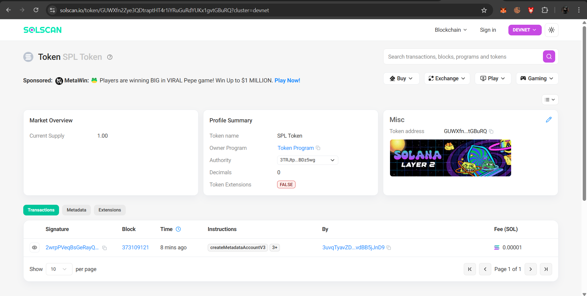

# Rent-Exempt-NFT-Minting-Program-with-Metadata
## Overview
This project implements a Solana program for minting NFTs that are rent-exempt with proper metadata. The NFT minting process is fully on-chain and handles all the necessary steps including metadata creation.

## Features
- On-chain NFT minting
- Rent-exempt token accounts
- Proper metadata creation and management
- Support for custom NFT attributes
- Simple CLI interface for minting

## Project Structure
- `programs/` - Contains the Solana program code
    - `nft-minting/` - NFT minting program implementation
- `app/` - Client application for interacting with the program
- `tests/` - Integration and unit tests

## Prerequisites
- Rust and Cargo
- Solana CLI tools
- Node.js and npm/yarn
- Anchor framework

## Installation
```bash
git clone https://github.com/dinesh3456/solana-nft-mint.git
cd solana-nft-mint
yarn install
```

## Building the Program
```bash
anchor build
```

## Deploying
```bash
solana program deploy target/deploy/nft_minting.so
```

## Using the CLI
```bash
node app/cli.js mint --name "My NFT" --symbol "MNFT" --uri "https://example.com/metadata.json"
```

## Development
To modify the program, edit the files in `programs/nft-minting/src/` and rebuild using `anchor build`.

## Testing
Run the test suite with:
```bash
anchor test
```


devnet transaction: https://solscan.io/token/GUWXfn2Zye3QDtraptHT4r1iYRuGuRdYUKx1gvtGBuRQ?cluster=devnet